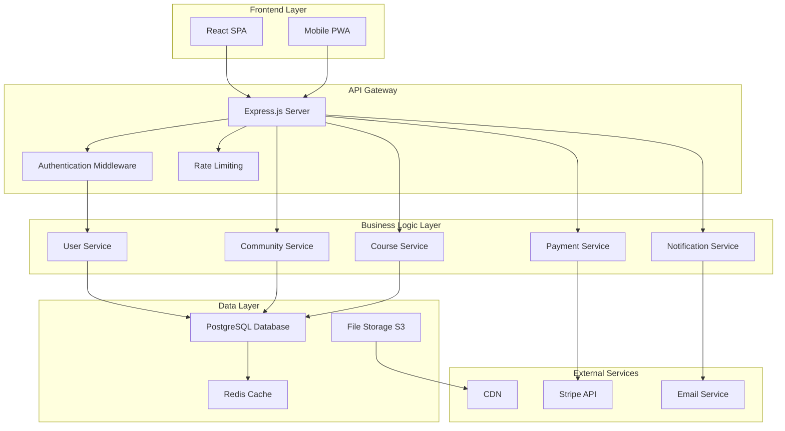

# Design Document: Community Learning Platform

## Overview

The community learning platform is a modern web application that combines course delivery, community engagement, and monetization features into a unified experience. The platform follows a three-tier architecture with a React frontend, Node.js/Express backend, and PostgreSQL database, designed to support thousands of concurrent users across multiple communities.

Key design principles:
- **Modularity**: Clear separation between courses, community, and payment systems
- **Scalability**: Horizontal scaling capabilities for high user loads
- **Security**: Robust authentication, authorization, and payment processing
- **Performance**: Optimized for fast content delivery and real-time interactions
- **Accessibility**: WCAG 2.1 AA compliance throughout the platform

## Architecture

### System Architecture



### Technology Stack

**Frontend:**
- React 18 with TypeScript for type safety and modern development
- React Router for client-side routing
- React Query for server state management and caching
- Tailwind CSS for responsive, utility-first styling
- Socket.io client for real-time features

**Backend:**
- Node.js with Express.js framework
- TypeScript for type safety across the stack
- Socket.io for real-time communication
- JWT for stateless authentication
- Prisma ORM for database operations

**Database & Storage:**
- PostgreSQL for primary data storage
- Redis for session management and caching
- AWS S3 for file storage (videos, images, documents)
- CloudFront CDN for global content delivery

**External Services:**
- Stripe for payment processing and subscription management
- SendGrid for transactional email delivery
- AWS SES for bulk email notifications

## Components and Interfaces

### Core Components

#### Authentication System
- **JWT-based authentication** with refresh token rotation
- **Role-based access control** (Admin, Creator, Member, Guest)
- **OAuth integration** for social login (Google, GitHub)
- **Password security** with bcrypt hashing and strength validation

#### User Management
- **User profiles** with customizable avatars and bio information
- **Activity tracking** for engagement metrics and gamification
- **Preference management** for notifications and privacy settings
- **Account verification** via email confirmation

#### Community Management
- **Community creation** with configurable settings and branding
- **Member management** with approval workflows and role assignment
- **Content moderation** with reporting and automated filtering
- **Analytics dashboard** for community insights and growth metrics

#### Course System
- **Hierarchical content structure** (Communities → Courses → Lessons)
- **Multi-media support** for text, video, images, and file attachments
- **Progress tracking** with completion status and time spent
- **Content scheduling** for drip-feed course releases

#### Discussion Platform
- **Threaded discussions** with nested comments and replies
- **Rich text editor** with markdown support and media embedding
- **Real-time updates** using WebSocket connections
- **Search and filtering** with full-text search capabilities

#### Gamification Engine
- **Points system** with configurable rules per community
- **Achievement badges** for milestone recognition
- **Leaderboards** with various ranking criteria
- **Activity streaks** to encourage consistent engagement

#### Payment Processing
- **Stripe integration** for secure payment handling
- **Subscription management** with automatic renewals and cancellations
- **Revenue analytics** with detailed financial reporting
- **Payout management** for creator earnings distribution

### API Design

#### RESTful API Structure
```
/api/v1/
├── /auth
│   ├── POST /login
│   ├── POST /register
│   ├── POST /refresh
│   └── POST /logout
├── /users
│   ├── GET /profile
│   ├── PUT /profile
│   └── GET /activity
├── /communities
│   ├── GET /
│   ├── POST /
│   ├── GET /:id
│   ├── PUT /:id
│   ├── POST /:id/join
│   └── DELETE /:id/leave
├── /courses
│   ├── GET /community/:id
│   ├── POST /community/:id
│   ├── GET /:id/lessons
│   └── POST /:id/lessons
├── /posts
│   ├── GET /community/:id
│   ├── POST /community/:id
│   ├── GET /:id/comments
│   └── POST /:id/comments
├── /payments
│   ├── POST /create-subscription
│   ├── POST /cancel-subscription
│   └── GET /billing-history
└── /notifications
    ├── GET /
    ├── PUT /:id/read
    └── PUT /preferences
```

#### Real-time Events (WebSocket)
- `community:new_post` - New post in community feed
- `community:new_comment` - New comment on post
- `community:member_joined` - New member joined community
- `user:points_awarded` - Points awarded to user
- `course:lesson_completed` - Lesson completion event

## Data Models

### Database Schema

#### Users Table
```sql
CREATE TABLE users (
    id UUID PRIMARY KEY DEFAULT gen_random_uuid(),
    email VARCHAR(255) UNIQUE NOT NULL,
    password_hash VARCHAR(255) NOT NULL,
    username VARCHAR(50) UNIQUE NOT NULL,
    display_name VARCHAR(100),
    bio TEXT,
    avatar_url VARCHAR(500),
    total_points INTEGER DEFAULT 0,
    email_verified BOOLEAN DEFAULT FALSE,
    created_at TIMESTAMP DEFAULT NOW(),
    updated_at TIMESTAMP DEFAULT NOW()
);
```

#### Communities Table
```sql
CREATE TABLE communities (
    id UUID PRIMARY KEY DEFAULT gen_random_uuid(),
    name VARCHAR(100) NOT NULL,
    description TEXT,
    slug VARCHAR(100) UNIQUE NOT NULL,
    creator_id UUID REFERENCES users(id),
    is_public BOOLEAN DEFAULT TRUE,
    requires_approval BOOLEAN DEFAULT FALSE,
    price_monthly DECIMAL(10,2),
    price_yearly DECIMAL(10,2),
    member_count INTEGER DEFAULT 0,
    created_at TIMESTAMP DEFAULT NOW(),
    updated_at TIMESTAMP DEFAULT NOW()
);
```

#### Community Memberships Table
```sql
CREATE TABLE community_memberships (
    id UUID PRIMARY KEY DEFAULT gen_random_uuid(),
    user_id UUID REFERENCES users(id),
    community_id UUID REFERENCES communities(id),
    role VARCHAR(20) DEFAULT 'member', -- member, moderator, admin
    status VARCHAR(20) DEFAULT 'active', -- pending, active, suspended
    joined_at TIMESTAMP DEFAULT NOW(),
    UNIQUE(user_id, community_id)
);
```

#### Courses Table
```sql
CREATE TABLE courses (
    id UUID PRIMARY KEY DEFAULT gen_random_uuid(),
    community_id UUID REFERENCES communities(id),
    title VARCHAR(200) NOT NULL,
    description TEXT,
    is_published BOOLEAN DEFAULT FALSE,
    sort_order INTEGER DEFAULT 0,
    created_at TIMESTAMP DEFAULT NOW(),
    updated_at TIMESTAMP DEFAULT NOW()
);
```

#### Lessons Table
```sql
CREATE TABLE lessons (
    id UUID PRIMARY KEY DEFAULT gen_random_uuid(),
    course_id UUID REFERENCES courses(id),
    title VARCHAR(200) NOT NULL,
    content TEXT,
    content_type VARCHAR(20) DEFAULT 'text', -- text, video, file
    video_url VARCHAR(500),
    file_url VARCHAR(500),
    is_free BOOLEAN DEFAULT FALSE,
    sort_order INTEGER DEFAULT 0,
    created_at TIMESTAMP DEFAULT NOW(),
    updated_at TIMESTAMP DEFAULT NOW()
);
```

#### Posts Table
```sql
CREATE TABLE posts (
    id UUID PRIMARY KEY DEFAULT gen_random_uuid(),
    community_id UUID REFERENCES communities(id),
    author_id UUID REFERENCES users(id),
    title VARCHAR(200),
    content TEXT NOT NULL,
    post_type VARCHAR(20) DEFAULT 'discussion', -- discussion, announcement
    like_count INTEGER DEFAULT 0,
    comment_count INTEGER DEFAULT 0,
    created_at TIMESTAMP DEFAULT NOW(),
    updated_at TIMESTAMP DEFAULT NOW()
);
```

#### Comments Table
```sql
CREATE TABLE comments (
    id UUID PRIMARY KEY DEFAULT gen_random_uuid(),
    post_id UUID REFERENCES posts(id),
    author_id UUID REFERENCES users(id),
    parent_id UUID REFERENCES comments(id), -- for nested comments
    content TEXT NOT NULL,
    like_count INTEGER DEFAULT 0,
    created_at TIMESTAMP DEFAULT NOW(),
    updated_at TIMESTAMP DEFAULT NOW()
);
```

#### User Progress Table
```sql
CREATE TABLE user_progress (
    id UUID PRIMARY KEY DEFAULT gen_random_uuid(),
    user_id UUID REFERENCES users(id),
    lesson_id UUID REFERENCES lessons(id),
    completed_at TIMESTAMP,
    time_spent INTEGER DEFAULT 0, -- in seconds
    UNIQUE(user_id, lesson_id)
);
```

#### Points Transactions Table
```sql
CREATE TABLE points_transactions (
    id UUID PRIMARY KEY DEFAULT gen_random_uuid(),
    user_id UUID REFERENCES users(id),
    community_id UUID REFERENCES communities(id),
    points INTEGER NOT NULL,
    reason VARCHAR(100) NOT NULL,
    reference_id UUID, -- ID of related entity (post, comment, etc.)
    created_at TIMESTAMP DEFAULT NOW()
);
```

#### Subscriptions Table
```sql
CREATE TABLE subscriptions (
    id UUID PRIMARY KEY DEFAULT gen_random_uuid(),
    user_id UUID REFERENCES users(id),
    community_id UUID REFERENCES communities(id),
    stripe_subscription_id VARCHAR(100) UNIQUE,
    status VARCHAR(20) NOT NULL, -- active, canceled, past_due
    current_period_start TIMESTAMP,
    current_period_end TIMESTAMP,
    created_at TIMESTAMP DEFAULT NOW(),
    updated_at TIMESTAMP DEFAULT NOW()
);
```

### Data Relationships

- **Users** can be members of multiple **Communities**
- **Communities** contain multiple **Courses** and **Posts**
- **Courses** contain multiple **Lessons** in sequential order
- **Posts** can have multiple **Comments** in threaded structure
- **Users** track **Progress** through individual **Lessons**
- **Points Transactions** record all gamification activities
- **Subscriptions** manage payment relationships between **Users** and **Communities**

## Correctness Properties

*A property is a characteristic or behavior that should hold true across all valid executions of a system—essentially, a formal statement about what the system should do. Properties serve as the bridge between human-readable specifications and machine-verifiable correctness guarantees.*

After analyzing the acceptance criteria, I've identified several categories of properties that can be combined for comprehensive testing:

### Property Reflection

Many individual acceptance criteria can be consolidated into broader properties that validate multiple requirements simultaneously:

- **Authentication properties** can cover both valid and invalid credential scenarios
- **Content management properties** can validate creation, organization, and access control together  
- **Payment processing properties** can handle both successful and failed payment scenarios
- **Notification properties** can cover delivery, preferences, and multi-channel support
- **Access control properties** can validate permissions across all content types and membership levels

### Core System Properties

**Property 1: Authentication Round Trip**
*For any* valid user credentials, successful authentication should allow access to protected resources, and logout should revoke that access
**Validates: Requirements 1.3, 1.4**

**Property 2: User Registration Validation**
*For any* user registration data, the system should create accounts for valid data and return descriptive errors for invalid data
**Validates: Requirements 1.1, 1.2**

**Property 3: Profile Management Consistency**
*For any* user profile updates, the system should persist changes and display updated information consistently across all views
**Validates: Requirements 1.5, 1.6**

**Property 4: Community Creation and Configuration**
*For any* valid community settings, creators should be able to create communities and modify all configurable properties (visibility, pricing, member management)
**Validates: Requirements 2.1, 2.2, 2.3, 2.4, 2.5, 2.6**

**Property 5: Content Organization Hierarchy**
*For any* course content operations (creation, reordering, publishing), the system should maintain correct hierarchical structure and access permissions
**Validates: Requirements 3.1, 3.2, 3.3, 3.4, 3.5**

**Property 6: Progress Tracking Consistency**
*For any* member lesson interactions, the system should accurately track and persist progress across all course content
**Validates: Requirements 3.6**

**Property 7: Discussion Thread Integrity**
*For any* community discussion operations (posts, comments, reactions), the system should maintain correct threading, engagement metrics, and chronological ordering
**Validates: Requirements 4.1, 4.2, 4.3, 4.4**

**Property 8: Content Search and Discovery**
*For any* search queries and filters, the system should return relevant results and provide appropriate reporting mechanisms
**Validates: Requirements 4.5, 4.6, 8.1, 8.2, 8.3, 8.4, 8.5, 8.6**

**Property 9: Gamification Points Consistency**
*For any* member activities, the system should award points according to rules, maintain accurate totals, update leaderboards, and grant achievements correctly
**Validates: Requirements 5.1, 5.2, 5.3, 5.4, 5.5, 5.6**

**Property 10: Access Control Enforcement**
*For any* membership operations (joining, approval, payment verification), the system should enforce correct access permissions and maintain audit logs
**Validates: Requirements 6.1, 6.2, 6.3, 6.4, 6.5, 6.6**

**Property 11: Payment Processing Integrity**
*For any* payment operations, the system should handle successful payments, failed payments, subscription lifecycles, and provide accurate financial reporting
**Validates: Requirements 7.1, 7.2, 7.3, 7.4, 7.5**

**Property 12: Notification System Reliability**
*For any* system activities, notifications should be delivered through appropriate channels, respect user preferences, support batching, and track engagement metrics
**Validates: Requirements 9.1, 9.2, 9.3, 9.4, 9.5, 9.6**

**Property 13: Cross-Platform Functionality**
*For any* API operations, all functionality should work correctly regardless of client device or platform
**Validates: Requirements 10.2**

## Error Handling

### Error Categories and Responses

#### Authentication Errors
- **Invalid credentials**: Return 401 with clear error message
- **Expired tokens**: Return 401 with token refresh instructions
- **Account not verified**: Return 403 with verification reminder
- **Rate limiting**: Return 429 with retry-after header

#### Validation Errors
- **Invalid input data**: Return 400 with field-specific error messages
- **Missing required fields**: Return 400 with list of missing fields
- **Data format errors**: Return 400 with format requirements
- **Business rule violations**: Return 422 with rule explanation

#### Authorization Errors
- **Insufficient permissions**: Return 403 with required permission level
- **Resource not found**: Return 404 for non-existent resources
- **Community access denied**: Return 403 with membership requirements
- **Payment required**: Return 402 with payment instructions

#### Payment Processing Errors
- **Card declined**: Return 402 with decline reason and retry options
- **Subscription expired**: Return 402 with renewal instructions
- **Payment method invalid**: Return 400 with validation requirements
- **Billing address mismatch**: Return 400 with address correction needs

#### System Errors
- **Database connection failures**: Return 503 with retry instructions
- **External service unavailable**: Return 503 with service status
- **File upload failures**: Return 500 with upload retry options
- **Rate limit exceeded**: Return 429 with backoff strategy

### Error Recovery Strategies

#### Client-Side Recovery
- **Automatic retry** for transient network errors (exponential backoff)
- **Token refresh** for expired authentication tokens
- **Offline mode** for core reading functionality
- **Form state preservation** during validation errors

#### Server-Side Recovery
- **Circuit breaker pattern** for external service failures
- **Database connection pooling** with automatic reconnection
- **Graceful degradation** when non-critical services are unavailable
- **Transaction rollback** for data consistency failures

#### User Experience
- **Clear error messages** in user-friendly language
- **Actionable instructions** for error resolution
- **Progress preservation** during recoverable errors
- **Alternative workflows** when primary paths fail

## Testing Strategy

### Dual Testing Approach

The testing strategy employs both unit testing and property-based testing as complementary approaches:

- **Unit tests**: Verify specific examples, edge cases, and error conditions
- **Property tests**: Verify universal properties across all inputs
- Together they provide comprehensive coverage where unit tests catch concrete bugs and property tests verify general correctness

### Property-Based Testing Configuration

**Testing Framework**: We will use **fast-check** for JavaScript/TypeScript property-based testing, which provides:
- Comprehensive input generation for complex data types
- Shrinking capabilities to find minimal failing examples
- Integration with Jest for seamless test execution

**Test Configuration**:
- **Minimum 100 iterations** per property test due to randomization
- Each property test must reference its design document property
- Tag format: **Feature: community-learning-platform, Property {number}: {property_text}**
- Each correctness property must be implemented by a single property-based test

### Unit Testing Strategy

**Framework**: Jest with TypeScript support for comprehensive testing

**Coverage Areas**:
- **API endpoint testing** with supertest for HTTP request/response validation
- **Database operations** with test database isolation
- **Authentication middleware** with mock JWT tokens
- **Payment integration** with Stripe test mode
- **Email delivery** with mock email service
- **File upload handling** with mock S3 operations

**Test Organization**:
- Co-locate tests with source files using `.test.ts` suffix
- Separate integration tests in dedicated test directories
- Mock external dependencies for isolated unit testing
- Use test factories for consistent test data generation

### Integration Testing

**End-to-End Scenarios**:
- Complete user registration and community joining flow
- Course content creation and member progress tracking
- Payment processing and subscription management
- Real-time notification delivery and engagement

**Testing Environment**:
- Isolated test database with automated cleanup
- Mock external services (Stripe, SendGrid, AWS)
- Containerized testing environment for consistency
- Automated test data seeding and teardown

### Performance Testing

**Load Testing**:
- Concurrent user simulation for community discussions
- Database query performance under high load
- File upload and streaming performance
- Real-time WebSocket connection scaling

**Monitoring**:
- Response time tracking for all API endpoints
- Database query performance metrics
- Memory usage and garbage collection monitoring
- Error rate tracking and alerting thresholds